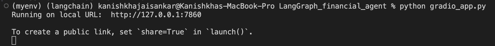
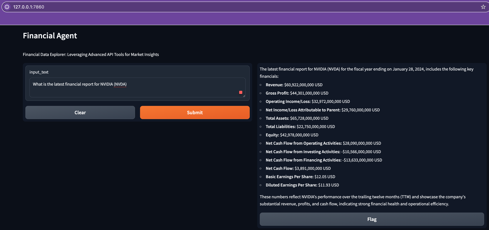
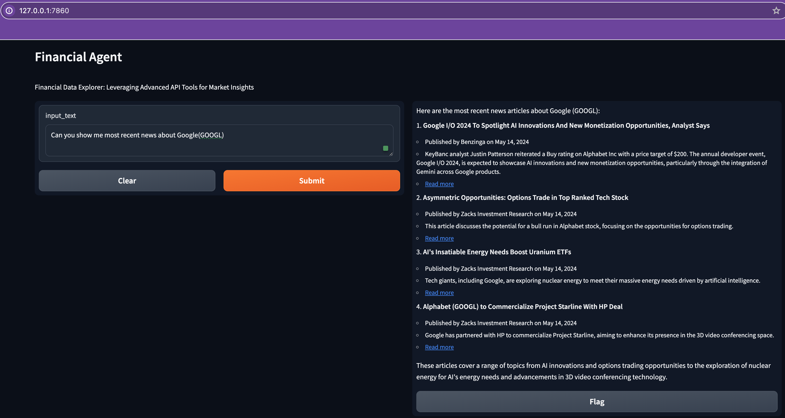
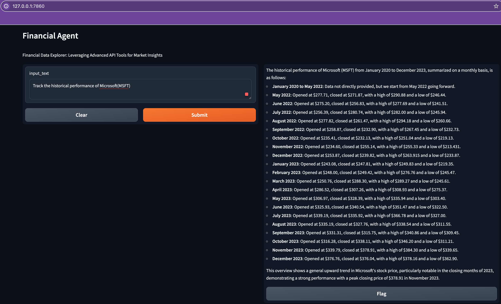
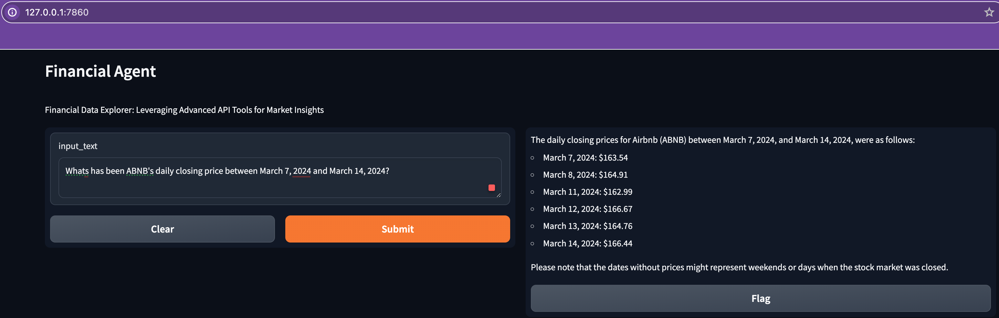

### Financial Agent that can perform these tasks. 

- Stock Price Retrieval 
- Latest News Retrieval 
- Financial Reports Retrieval 
- Historic Prices Retrieval 


Built using LangGraph.  


Steps to build an AI Agent:
1. Create Tools 
2. Assign Tools to Agents 
3. Create Graph to coordinate Agents with Tools
4. User Interface using Gradio

Requirements: 

1. OPENAI_API_KEY
2. POLYGON_API_KEY (API services capable of getting latest information on financial side, stock price) 
Polygon.ai - free stock market API - [polygon.io](https://polygon.io)

```bash 
conda create -n langchain python=3.9
```

```bash 
conda activate langchain
```

```bash
pip install langgraph langchain langchain_openai langchainhub polygon-api-client
```

```bash 
export OPENAI_API_KEY=xxxxx
```    

```bash
export POLYGON_API_KEY=xxxxx
```   

```bash 
touch app.py 
```

1. Define tools
2. Create agents
3. Create graph

```bash 
python app.py 
```  

Output Image:  


```bash 
touch gradio_app.py 
```  

```bash 
python gradio_app.py 
```

Follow the local host link 




#### Gradio App






